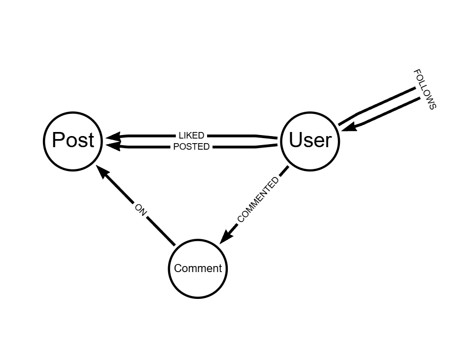
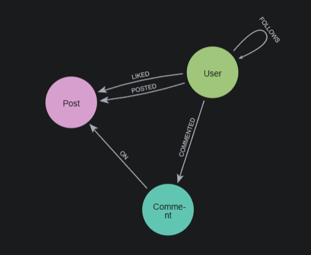
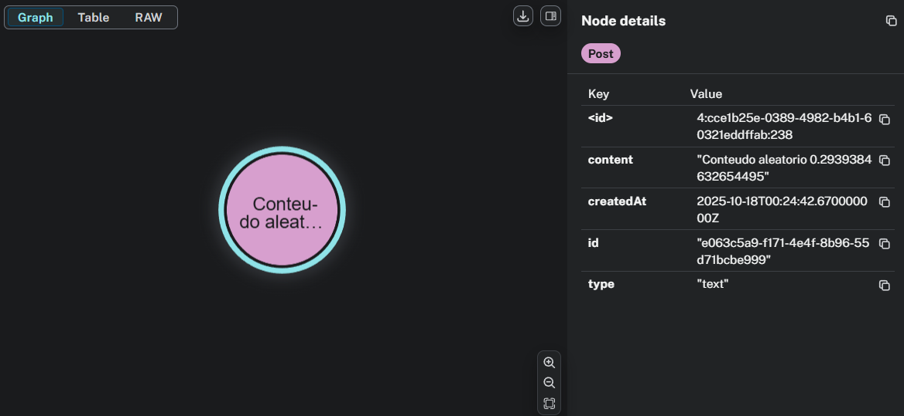
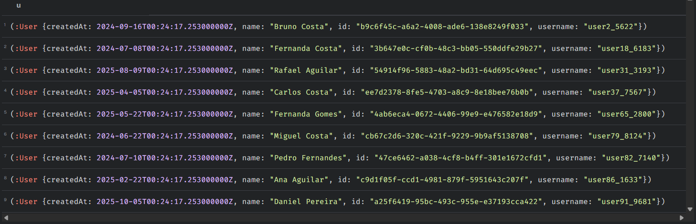
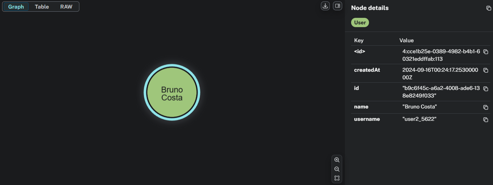

# Atividade: Sistema de Recomendação de Música

## Descrição da Atividade

## Modelagem (arrows.app)

## Carregamento dos dados

Os dados são criados aleatóriamente:

### Random Users
        WITH

        ["Lara","Joao","Maria","Ana","Carlos","Bruno","Julia","Miguel","Lucas","Marina",
        "Pedro","Bianca","Rafael","Fernanda","Gabriel","Patricia","Sofia","Enzo",
        "Daniel","Leticia"] AS firstNames,
        ["Oliveira","Silva","Aguilar","Santos","Costa","Fernandes","Almeida","Ribeiro",
        "Carvalho","Barbosa","Gomes","Castro","Martins","Pereira","Souza","Azevedo"] AS lastNames

        UNWIND range(1,100) AS i
        CREATE (:User {
            id: randomUUID(),
            username: "user" + i + "_" + toString(toInteger(rand()*10000)),
            name: firstNames[toInteger(rand()*size(firstNames))]
                + " " +
                lastNames[toInteger(rand()*size(lastNames))],
            createdAt: datetime() - duration({days: toInteger(rand()*730)})
        });

### Random Follows Relationship

        MATCH (u:User)
        WITH collect(u) AS users
        UNWIND users AS u1
        WITH users, u1, range(1, toInteger(rand()*10)+1) AS followCount
        UNWIND followCount AS i
        WITH u1, users[toInteger(rand()*size(users))] AS u2
        WHERE u1 <> u2
        MERGE (u1)-[:FOLLOWS {since: datetime() - duration({days: toInteger(rand()*700)})}]->(u2);

### Random Posts Relationship

        MATCH (u:User)
        WITH u, range(1, toInteger(rand()*5)) AS posts
        UNWIND posts AS p
        CREATE (post:Post {
            id: randomUUID(),
            content: "Conteudo aleatorio " + toString(rand()),
            type: ["photo","video","text"][toInteger(rand()*3)],
            createdAt: datetime() - duration({days: toInteger(rand()*60)})
        })
        CREATE (u)-[:POSTED]->(post);

### Random Likes Relationship

        MATCH (p:Post), (u:User)
        WITH p, collect(u) AS users
        WITH p, users, size(users) AS total
        WITH p, users, range(1, toInteger(rand()*20)) AS likeCount
        UNWIND likeCount AS i
        WITH p, users[toInteger(rand()*size(users))] AS liker
        MERGE (liker)-[:LIKED {
            createdAt: datetime() - duration({days: toInteger(rand()*60)})
        }]->(p);

### Random Comments Relationship

        MATCH (p:Post), (u:User)
        WITH p, collect(u) AS users
        WITH p, users, range(1, toInteger(rand()*10)) AS commentCount
        UNWIND commentCount AS i
        WITH p, users[toInteger(rand()*size(users))] AS commenter, i
        CREATE (c:Comment {
            id: randomUUID(),
            text: "Comentario " + toString(i),
            createdAt: datetime() - duration({days: toInteger(rand()*60)})
        })
        CREATE (commenter)-[:COMMENTED]->(c)
        CREATE (c)-[:ON]->(p);

### Visualização do Schema

## Resultados

### Qual a postagem mais curtida no último mês baseado no critério X?

Exemplo: Ordenação por quantidade de curtidas no ultimo mes

        MATCH (p:Post)<-[l:LIKED]-(:User)
        WHERE l.createdAt >= datetime() - duration("P1M")
        WITH p, count(l) AS likesLastMonth
        RETURN p, likesLastMonth
        ORDER BY likesLastMonth DESC
        LIMIT 1;

### Quais pessoas curtiram essa postagem?

id utilizado: "299f52a2-1b1d-4360-aeeb-e253c4e21cff"

        MATCH (u:User)-[:LIKED]->(p:Post {id: $postId})
        RETURN u;

### Quais dessas pessoas eu sigo?

id do usuario: "3b647e0c-cf0b-48c3-bb05-550ddfe29b27"
id do post: "299f52a2-1b1d-4360-aeeb-e253c4e21cff"

        MATCH (me:User {id: $myId})-[:FOLLOWS]->(u:User),
        (u)-[:LIKED]->(p:Post {id: $postId})
        RETURN u;

### Quem comentou em um post + ordenado por tempo

id utilizado: "299f52a2-1b1d-4360-aeeb-e253c4e21cff"

        MATCH (u:User)-[:COMMENTED]->(c:Comment)-[:ON]->(p:Post {id: $postId})
        RETURN u, c
        ORDER BY c.createdAt DESC;

